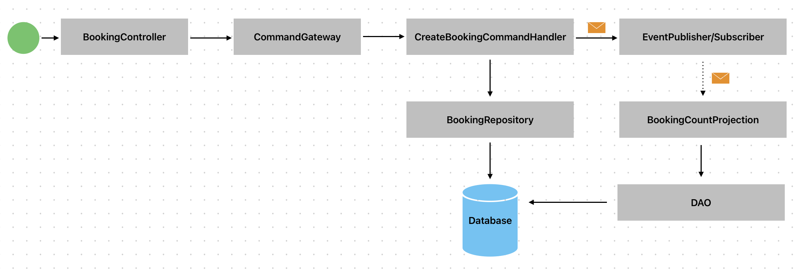
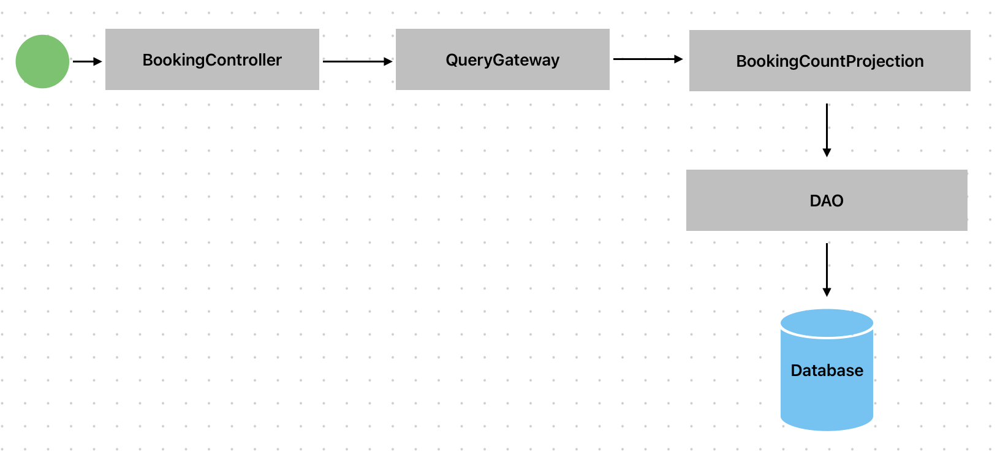

## Booking Service

### API docs

Copy and paste the [OpenAPI file](etc/openapi.yaml) to https://editor.swagger.io. 

### Packages structure

- `domain`: This package contains the domain model and logic. Domain uses interfaces to talk to the external elements (database, messaging systems...) 
  - `command`: Business logic and write models
  - `query`: Read models / projections.
  - `common`: Elements that both sides, command an query, use.
- `adapter`: This package contains the actual implementation of the primary/driving and secondary/driven adapters
  - `db`: Database implementations of BookingRepository and DAO (secondary adapters)
  - `event`: Event publisher and subscriber in memory implementations (secondary adapters)
  - `http`: REST primary adapter implementation (HTTP controller). It talks to the domain via primary/input ports (CommandGateway and QueryGateway)

### Create booking use case

### Get booking count use case

